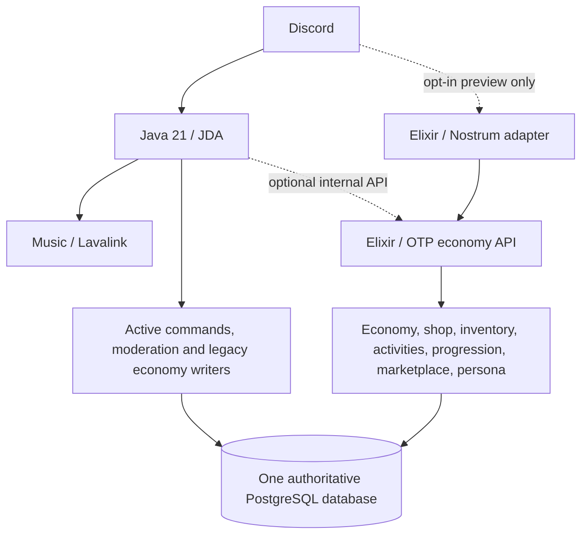

# Tori

Tori is a Discord bot built with Java/JDA and an evolving Elixir/OTP domain layer. She combines music, an economy with shop and inventory, activities, profiles, marketplace features, moderation, tickets and orders. The current production Discord experience still runs primarily through Java. The Elixir rewrite adds gated domain paths and foundations for persona, mood and seasonal presentation, but it is **not a production economy cutover**.

## Architecture and current ownership



Java owns the live JDA commands, music/Lavalink integration, moderation, tickets, orders, Discord presence, and the existing production economy and marketplace writes. Elixir exposes structured domain operations through an internal API and supervised OTP processes. Java and Elixir target the **same Tori PostgreSQL database**; test databases are disposable, isolated environments, not a second runtime datastore. Routing and the Elixir WriteGate prevent simultaneous writers during migration.

| Area | Available in this repository | Production status |
| --- | --- | --- |
| Music, moderation, tickets and orders | Java/JDA implementations | Java-owned |
| Economy reads: balance, inventory, shop and leaderboard | Legacy Java and optional Elixir API routes | Defaults to Java `LEGACY` |
| Daily and transfer | Legacy Java and gated Elixir transactions with ledger/idempotency | Java-owned; Elixir production writes disabled |
| Shop, wardrobe, cosmetics, activities, consumables, progression, careers and escrow marketplace | Elixir domain operations, persisted state and isolated-test mutation paths | New Elixir mutations test-gated; Java remains active |
| Persona, mood, seasons and presence suggestions | Semantic rendering, supervised transient mood and seasonal overlay | Elixir presentation API exists; live Java responses/presence are not cut over |
| Nostrum | Opt-in guild-scoped preview commands for profile, shop, wardrobe, marketplace, careers, activities, consumables and persona | Off by default; test WriteGate still applies; no production command ownership |

## Elixir domain

`Tori/economy-v2` contains the internal Bandit API and OTP supervision tree. It implements profile snapshots, semantic Persona responses with neutral fallbacks, stateful mood and intensity, deterministic seasonal overlays, and presence suggestions. These affect presentation only; they do not alter permissions, transaction outcomes or balances. Java continues to select the actual Discord status.

The original 66-item catalog is expanded by V10 with 61 additional seed definitions spanning Fashion, Accessories, Beauty, Ballet, Volleyball, Cheer and Seasonal styles; existing stable IDs are preserved, and the isolated migration test requires at least 125 active catalog items. The domain supports weighted, season-aware drops persisted for a period, category/page browsing, item inspection, ownership and unlock state, atomic purchases against the existing wallet and inventory, clothing loadouts, permanent cosmetic selections, configured consumable effects, and escrow marketplace operations. Fishing, mining and chopping have gated Elixir parity paths that reuse legacy tools and cooldowns; Java still owns their live execution.

Progression includes a database-seeded level curve, idempotent/cooldown-controlled XP grants, retained Ballet/Volleyball/Cheer career progress, practice actions and configured unlock requirements. These domain capabilities have not been verified against a fresh PostgreSQL test database in this implementation pass. The Nostrum adapter registers only uniquely named preview commands in one explicitly configured guild when both opt-in flags are enabled, and refuses to start unless `TORI_ECONOMY_WRITE_MODE=test` and the configured database matches the connected `*_test` database. Responses use ephemeral embeds, category selection and shop-page buttons; commands are acknowledged before domain work to avoid Discord's interaction timeout. Writes still pass through WriteGate. It is not a replacement for JDA command ownership. See [rewrite status](Tori/docs/ELIXIR-REWRITE-STATUS.md) for exact limitations and ownership.

## Technology

Java 21, JDA, Gradle, Lavalink, Elixir 1.18, Erlang/OTP, Mix, Ecto/Postgrex, Bandit, PostgreSQL 17, Flyway, Docker and Docker Compose. Nostrum is present as an experimental dependency and disabled adapter. MongoDB/FerretDB-related code remains for historical migration or compatibility; PostgreSQL is the active runtime database.

## Repository layout

| Path | Purpose |
| --- | --- |
| [`Tori/src/main/java/music`](Tori/src/main/java/music) | Java bot, commands, music and current Discord integrations |
| [`Tori/economy-v2`](Tori/economy-v2) | Elixir API, domain services, OTP supervision and tests |
| [`Tori/src/main/resources/db/migration`](Tori/src/main/resources/db/migration) | Flyway PostgreSQL migrations |
| [`Tori/database-*`](Tori) | Database interfaces/adapters and legacy migration tooling |
| [`Tori/docs`](Tori/docs) | Architecture, rollout and validation notes |
| [`Tori/compose.yaml`](Tori/compose.yaml), [`Tori/Dockerfile`](Tori/Dockerfile) | Service orchestration and Java image |

## Development and configuration

Use the Java wrapper; no global Gradle installation is required. The Elixir project uses Mix. Start by copying `Tori/.env.example` to `Tori/.env` and replacing the placeholders locally. The required Compose secrets are `DISCORD_TOKEN`, `TORI_POSTGRES_PASSWORD`, `LAVALINK_PASSWORD` and `TORI_ECONOMY_API_SECRET`. Keep `.env`, Discord tokens and database credentials out of commits.

```sh
cd Tori
./gradlew clean test build --no-daemon

cd economy-v2
mix deps.get
mix format --check-formatted
mix compile --warnings-as-errors
mix test
```

On Windows, use `gradlew.bat` instead of `./gradlew`. Compose defines one PostgreSQL service, Lavalink, the internal-only `economy-api`, and the Java bot:

```sh
cd Tori
docker compose config --quiet
```

Compose startup/build is a **deployment action**, not a validation substitute. Do not start the new Java image against production until the migration and backup checks below are complete. The API is exposed to the Compose network on port 4001, not published as a public site.

## Database and migration safety

The PostgreSQL schema is authoritative. Flyway migrations **V1–V10 are present in this repository**; V6–V10 extend catalog, rotations, progression, marketplace, legacy activity identifiers, consumable effects, cosmetic selections and configured career actions additively. Their presence in Git does **not** mean they have been applied to production. Java startup can apply pending Flyway migrations, so validate the stack on the Raspberry Pi and verify a production backup by restoring it to a separate database **before** deploying a new image.

Financial and item mutations use persistent idempotency keys, ledger/event records and database transactions. Exactly one service may write a given domain in production. Do not enable a new Elixir writer while a Java command or market path can still change the same wallet or inventory rows. Integration tests must target an explicitly configured, isolated `*_test` PostgreSQL database; the test harness applies the repository's Flyway schema to a fresh test database and rejects other targets.

## Validation

Run these checks on the Raspberry Pi before deployment or cutover. This implementation pass has **not been runtime-verified in this Windows environment**: Mix and Docker are unavailable, and the Gradle wrapper could not download its distribution because network access was denied.

```sh
cd Tori
./gradlew clean test build --no-daemon
docker compose config --quiet

cd economy-v2
mix deps.get
mix format --check-formatted
mix compile --warnings-as-errors
mix test
```

For the full Elixir PostgreSQL integration suite, set `TORI_ECONOMY_TEST_DATABASE_URL` to an explicitly isolated, reachable database whose name ends in `_test`, then run `mix test`. Never point it at Tori's production database. The test schema helper applies V1–V10 from the Java Flyway directory to an empty test database. The [rewrite status](Tori/docs/ELIXIR-REWRITE-STATUS.md) records the disposable PostgreSQL procedure and outstanding validation.

## Production status

The shipped Compose defaults keep every `TORI_ECONOMY_ROUTING` area on `LEGACY`, `TORI_ECONOMY_WRITE_ENABLED=false` and `TORI_ECONOMY_WRITE_MODE=disabled`. Nostrum is off by default; enabling its preview requires a dedicated test application, token and guild, and does not transfer command ownership. Java remains the active production writer for existing economy, marketplace and activity paths. This implementation pass has not been validated by Mix, a fresh PostgreSQL integration run, Gradle, or Compose. The rewrite still requires Raspberry Pi checks, V10 migration review, production backup/restore verification and explicit writer-ownership decisions before deployment or cutover. No route or write gate should be changed merely because an Elixir implementation exists.

This project is licensed under the [Apache License 2.0](LICENSE).
